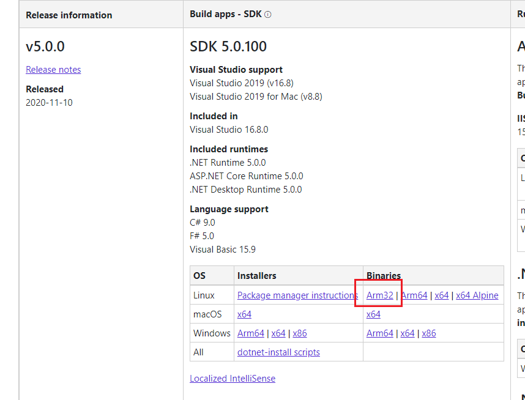

# Getting Started with the Raspberry Pi and .NET 5 

Getting started with **.NET 5** and a **Raspberry Pi** is really easy. 

## Install .NET 5 on a Raspberry Pi

Download the Latest .NET SDK from here:  [.NET 5 SDK] (https://dotnet.microsoft.com/download/dotnet/5.0)

Install the ARM32 version of .NET 5. 

